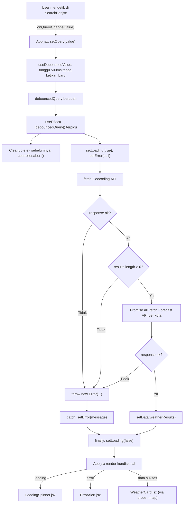
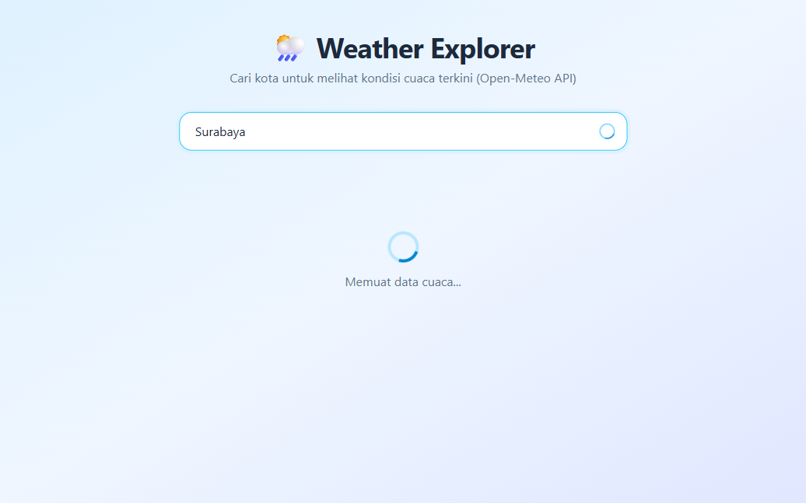
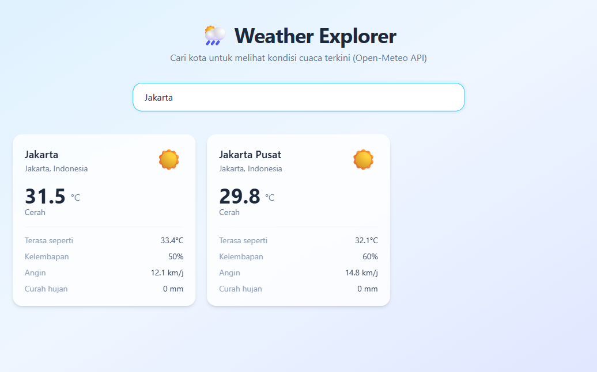
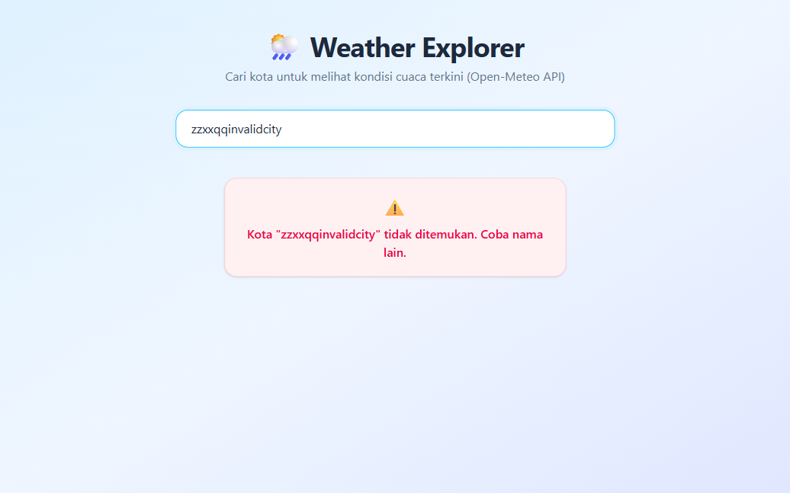
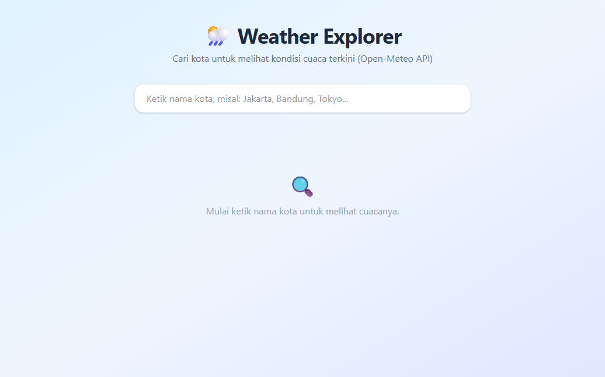

# 🌦️ Weather Explorer

Aplikasi React (Vite) untuk mencari kondisi cuaca kota secara real-time, dibuat untuk Hands-On Challenge & Take-Home Assignment mata kuliah **Pemrograman Internet — Pertemuan 4: Side Effects & Fetching REST API** (Teknologi Informasi, Universitas Udayana).

Tema: **Live Weather Explorer**, menggunakan **Open-Meteo API** (gratis, tanpa API key).

---

## 1. Endpoint API & Struktur JSON

Aplikasi ini memanggil **dua** endpoint REST API publik dari Open-Meteo secara berurutan (chained fetch) setiap kali pengguna mengetik nama kota.

### a. Geocoding API — mencari koordinat kota

```
GET https://geocoding-api.open-meteo.com/v1/search?name={kota}&count=5&language=id&format=json
```

Contoh respons JSON (ringkas):

```json
{
  "results": [
    {
      "id": 1642911,
      "name": "Jakarta",
      "latitude": -6.21462,
      "longitude": 106.84513,
      "country": "Indonesia",
      "admin1": "Jakarta"
    }
  ]
}
```

### b. Forecast API — mengambil cuaca terkini berdasarkan koordinat

```
GET https://api.open-meteo.com/v1/forecast?latitude={lat}&longitude={lon}&current=temperature_2m,relative_humidity_2m,apparent_temperature,is_day,precipitation,weather_code,wind_speed_10m&timezone=auto
```

Contoh respons JSON (ringkas):

```json
{
  "current": {
    "temperature_2m": 31.5,
    "relative_humidity_2m": 50,
    "apparent_temperature": 33.4,
    "precipitation": 0,
    "weather_code": 0,
    "wind_speed_10m": 12.1
  }
}
```

Kedua respons ini digabung menjadi satu objek `{ location, weather }` per kota, lalu disimpan ke state `data` sebagai array (karena satu nama kota bisa punya beberapa kandidat lokasi — mis. "Bandung" bisa cocok dengan beberapa kota berbeda).

---

## 2. Bedah Code `useEffect` & 3 State

### Struktur Folder Modular

```
src/
├── components/
│   ├── SearchBar.jsx       ← Controlled input pencarian
│   ├── WeatherCard.jsx     ← UI 1 kartu cuaca
│   ├── LoadingSpinner.jsx  ← Indikator loading
│   ├── ErrorAlert.jsx      ← Alert pesan error
│   └── EmptyState.jsx      ← Placeholder state awal
├── utils/
│   └── weatherCodes.js     ← Mapping kode cuaca WMO → label & ikon
└── App.jsx                 ← Parent: useEffect, fetch, & 3 state wajib
```

### Diagram Alur Fetching API



### Penjelasan Baris Demi Baris (`src/App.jsx`)

**3 State Wajib:**

```js
const [data, setData] = useState(null)       // menyimpan hasil JSON gabungan {location, weather}
const [loading, setLoading] = useState(false) // true selama request berjalan
const [error, setError] = useState(null)      // pesan error yang ramah untuk ditampilkan
```

**Debounce — mencegah fetch di setiap ketikan:**

```js
function useDebouncedValue(value, delay) {
  const [debounced, setDebounced] = useState(value)
  useEffect(() => {
    const timeoutId = setTimeout(() => setDebounced(value), delay)
    return () => clearTimeout(timeoutId) // batalkan timer lama jika user mengetik lagi
  }, [value, delay])
  return debounced
}
```

Input mentah (`query`) dipisahkan dari nilai yang dipakai untuk fetch (`debouncedQuery`). Setiap karakter yang diketik me-reset timer 500ms; fetch baru berjalan hanya ketika user berhenti mengetik.

**`useEffect` reaktif + `AbortController` (mencegah race condition):**

```js
useEffect(() => {
  if (!debouncedQuery) { setData(null); setError(null); setLoading(false); return }

  const controller = new AbortController()

  async function fetchWeather() {
    setLoading(true)
    setError(null)
    try {
      const geoResponse = await fetch(`${GEOCODING_URL}?...`, { signal: controller.signal })
      if (!geoResponse.ok) throw new Error(`Gagal menghubungi layanan pencarian kota (status ${geoResponse.status})`)

      const geoJson = await geoResponse.json()
      const locations = geoJson?.results ?? []
      if (locations.length === 0) throw new Error(`Kota "${debouncedQuery}" tidak ditemukan. Coba nama lain.`)

      const weatherResults = await Promise.all(
        locations.map(async (location) => {
          const weatherResponse = await fetch(`${FORECAST_URL}?...`, { signal: controller.signal })
          if (!weatherResponse.ok) throw new Error(`Gagal mengambil data cuaca untuk ${location.name}`)
          const weatherJson = await weatherResponse.json()
          return { location, weather: weatherJson?.current }
        }),
      )
      setData(weatherResults)
    } catch (err) {
      if (err.name === 'AbortError') return   // request dibatalkan, bukan error sungguhan
      setError(err.message || 'Terjadi kesalahan jaringan. Silakan coba lagi.')
      setData(null)
    } finally {
      setLoading(false)  // SELALU berjalan, apapun hasilnya
    }
  }

  fetchWeather()
  return () => controller.abort()  // cleanup: batalkan request lama saat query berubah lagi
}, [debouncedQuery])
```

Penjelasan poin penting:

| Baris / Konsep | Penjelasan |
|---|---|
| `dependency array [debouncedQuery]` | Efek hanya dijalankan ulang saat `debouncedQuery` berubah — bukan di setiap render. |
| `new AbortController()` + `signal: controller.signal` | Menghubungkan fetch dengan sinyal pembatalan. |
| `return () => controller.abort()` | **Cleanup function** — dijalankan React sebelum efek berikutnya berjalan (atau saat unmount). Jika user mengetik huruf baru sebelum request lama selesai, request lama dibatalkan agar tidak terjadi *race condition* (data kota lama menimpa data kota baru). |
| `if (!geoResponse.ok) throw new Error(...)` | `fetch()` **tidak** otomatis melempar error untuk status HTTP 404/500 — harus dicek manual via `response.ok`. |
| `try...catch...finally` | `try` mencoba request, `catch` menangani error (termasuk mengabaikan `AbortError` yang bukan error sungguhan), `finally` **selalu** menjalankan `setLoading(false)` apapun hasilnya. |
| `item.weather?.temperature_2m?.toFixed?.(1) ?? '--'` (di `WeatherCard.jsx`) | **Optional chaining** mencegah `TypeError: Cannot read property of null` saat data belum lengkap. |

**Alur props antar komponen** (pola Parent-Child sesuai materi):

1. `App.jsx` (Parent) memegang `useEffect` + 3 state, lalu meneruskan `item` ke `WeatherCard.jsx` via props.
2. `SearchBar.jsx` (Child) mengirim keyword baru ke Parent lewat callback `onQueryChange`.
3. `LoadingSpinner.jsx` dan `ErrorAlert.jsx` dirender kondisional oleh Parent berdasarkan state `loading`/`error`.

---

## 3. Screenshot UI

| Loading | Sukses | Error |
|---|---|---|
|  |  |  |

State awal (sebelum mengetik apa pun):



---

## 4. Log Prompt AI

Proyek ini dikerjakan dengan bantuan Claude Code (Anthropic). Berikut prompt yang digunakan, persis seperti yang diketik:

**Prompt 1 (membuat proyek awal):**
> Saya ingin menyelesaikan Hands-On Challenge materi kuliah Pemrograman Internet: "Side Effects & Fetching REST API".
>
> Tolong buatkan aplikasi web React sederhana menggunakan Vite (React + JavaScript) dengan tema Country Explorer menggunakan RestCountries API (v3.1) atau Open-Meteo Weather API.
>
> Spesifikasi dan batasan teknis:
> 1. Inisialisasi struktur proyek React Vite yang bersih.
> 2. Gunakan Hook `useEffect` dengan dependency array reaktif terhadap input pencarian (misal `[search]` atau `[query]`). Terapkan debounce sederhana atau AbortController untuk mencegah race condition.
> 3. Wajib mengelola 3 state utama:
>    - `data`: Menyimpan hasil JSON dari API
>    - `loading`: Boolean untuk indikator loading/spinner saat fetch berjalan
>    - `error`: Menyimpan pesan error jika pencarian tidak ditemukan atau jaringan bermasalah
> 4. Penanganan fetch yang aman:
>    - Gunakan sintaksis `async/await` di dalam `try...catch...finally`
>    - Cek manual `response.ok` (karena fetch tidak otomatis throw error saat HTTP 404/500)
>    - Pastikan `setLoading(false)` selalu berjalan di blok `finally`
>    - Gunakan optional chaining (`?.`) saat rendering data untuk mencegah error null
> 5. Styling ringkas dan modern menggunakan Tailwind CSS inline/utility class (atau CSS minimalis yang rapi).
> 6. Tampilkan UI secara kondisional untuk 3 kondisi: saat loading, saat error (tampilkan pesan error yang ramah), dan saat data berhasil dimuat (dalam bentuk card).
>
> Jalankan perintah yang dibutuhkan dan buat kodenya langsung di file proyek.

**Prompt 2 (verifikasi terhadap materi dosen):**
> @"C:\Users\rainbow\Downloads\Slide_Pertemuan_4_Pemrograman_Internet.html"
> coba perhatikan materi yang diberikan dosenku ini, apakah project yang kita buat udah menggunakan teori2 yang diberikan? dan memenuhi kriteria petunjuk pada page 21

**Prompt 3 (konfirmasi lanjut refactor modular + README):**
> okay

---

## Menjalankan Proyek

```bash
npm install
npm run dev
```

Buka `http://localhost:5173` lalu ketik nama kota (misal: Jakarta, Bandung, Tokyo) di kolom pencarian.
